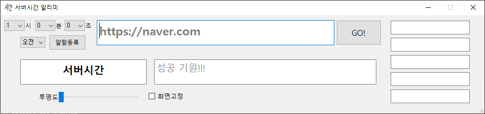

# Server Time: 서버 시간 알리미

기본 화면

## 1. 기능

### 1.1. 알람

지정된 시간에 알람이 울리게 할 수 있다.

### 1.2. 화면고정

서버시간 프로그램 바깥으로 포커스가 벗어나도 창이 사라지지 않는다.

### 1.3. Copy Box 클립보드

수강신청 시, 수강코드 입력을 쉽게 하기 위해서 Copy Box를 제작하였다.
해당 박스를 누르는 순간 자동으로 텍스트가 클립보드에 복사된다.

## 2. 사용 후기

개발자 및 주변인의 수강신청 올클 소식 다수
